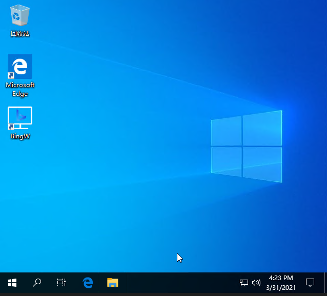

    

  

[English](./readme.md) | 简体中文

# BingW  
自动设置壁纸为bing每日壁纸  

## 内容列表

- [背景](#背景)
- [安装](#安装)
- [使用说明](#使用说明)
    - [功能列表](#功能列表)
- [相关项目](#相关项目)
- [编译方法](#编译方法)
- [使用许可](#使用许可)

## 背景  
编写这个程序是因为bing官方的壁纸程序在我的系统上无法使用，也没有任何错误提示，因此使用Qt重新写了一个，加上了通过Google earth搜索功能。

## 安装
从release下载zip压缩包后，解压到指定目录。

## 使用说明  
  
打开BingW.exe，即可自动检测并设置最新的bing壁纸，启动后程序会显示在任务栏托盘区域，右键图标可以看到一些功能选项，默认是随系统启动，可以通过托盘右键关闭  
### 功能列表  
* 切换最近一周的壁纸  
* 通过bing搜索壁纸相关信息  
* 通过Google earth搜索壁纸相关地点（只有风景壁纸适合使用）  
* 保持当前壁纸，不自动更新  

## 相关项目
* [Qt](https://www.qt.io/) 一个强大的跨平台C++框架  
* [xmake](https://github.com/xmake-io/xmake) 基于lua的跨平台，易于使用的构建系统  

## 编译方法
目前只支持windows系统，建议使用MSVC进行编译，安装好Qt，xmake之后，在代码的根目录执行`xmake`命令即可编译

## 使用许可
[Apache License 2.0](https://www.apache.org/licenses/LICENSE-2.0)

## IP GEO
纯真(CZ88.NET)自2005年起一直为广大社区用户提供社区版IP地址库，只要获得纯真的授权就能免费使用，并不断获取后续更新的版本。如果有需要免费版IP库的朋友可以前往纯真的官网进行申请。
纯真除了免费的社区版IP库外，还提供数据更加准确、服务更加周全的商业版IP地址查询数据。纯真围绕IP地址，基于 网络空间拓扑测绘 + 移动位置大数据 方案，对IP地址定位、IP网络风险、IP使用场景、IP网络类型、秒拨侦测、VPN侦测、代理侦测、爬虫侦测、真人度等均有近20年丰富的数据沉淀。

---

<h3>For rabbit</h3>

